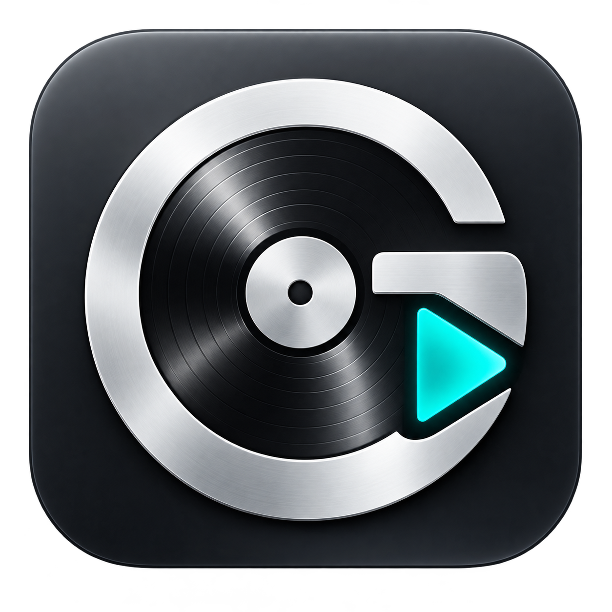
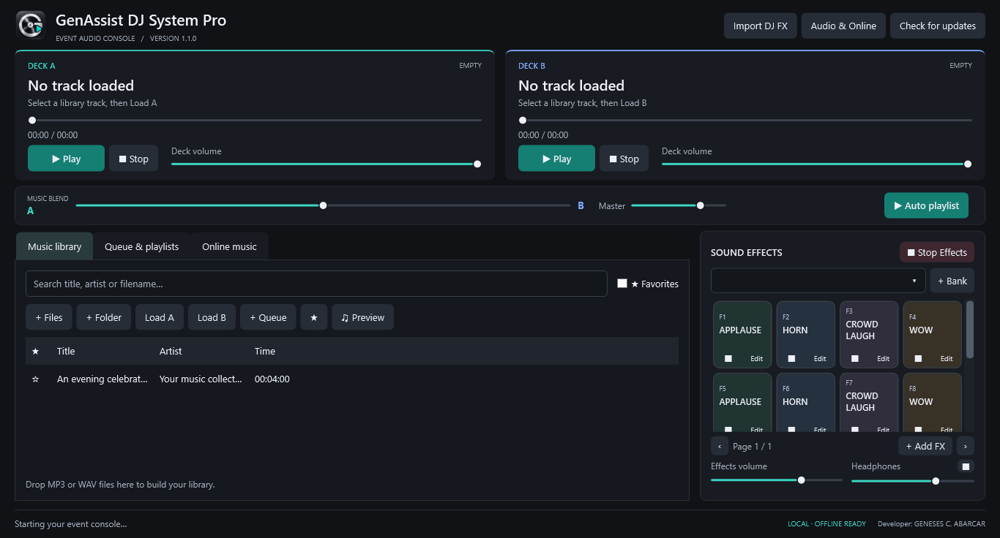

# GenAssist DJ System Pro

**Developer: GENESES C. ABARCAR**

A professional Windows event audio console with two music decks, sound-effect banks, automatic playlist fades and independent headphone preview.

## Download

Get the Windows x64 ZIP from the [latest official release](https://github.com/EduFilesPH/genassist-dj-system-pro-releases/releases/latest).

1. Extract the entire ZIP to a folder.
2. Open the extracted folder and double-click **GenAssist DJ System Pro.exe**. Keep the DLLs and runtime files alongside it.
3. Import MP3/WAV songs with **+ Files** or **+ Folder**, load deck A or B, and play. Add your own effects to the sound-effect banks.

The download includes its .NET runtime. Application data is stored in `%LOCALAPPDATA%\GenAssist\DJSystemPro`.

## Updates

Use **Check for updates** in the app to check this repository for a newer stable version. The app displays the result and lets you open the official release page. Download and installation are manual. Close the app before replacing files; your library and settings remain in local app data. Update checks send no account credentials or music-library data.

## Features

- Two independent decks with seek, volume and crossfader controls.
- Sound-effect pads with overlapping playback, per-pad stop and shortcuts.
- Music library, favorites, queue and saved playlists.
- Automatic playlist playback with adjustable fades.
- Separate speaker and headphone output devices.
- Optional Jamendo discovery and licensed downloads using your own client ID.
- Clean dark console and native Windows app icon.

This public repository contains release documentation and packaged downloads. Application source is maintained privately. Third-party notices and required third-party source/license files accompany the Windows download. Original DJ FX PRO audio is not redistributed.

The Windows binary is currently unsigned. Headphone isolation requires two separately addressable playback devices. Live Jamendo use requires your own client ID.
